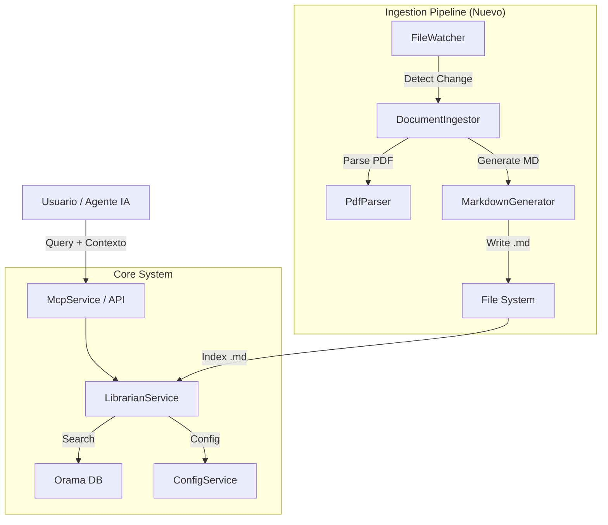

# [DESIGN] Arquitectura Contextual para Akuri ACP

## Resumen Ejecutivo
Este diseño define la arquitectura para transformar `akuri-acp` en una herramienta de contexto avanzada. Se introduce un pipeline de normalización que convierte documentos (PDF) a Markdown estandarizado, y un motor de búsqueda jerárquico que prioriza resultados según su origen (Proyecto > Workspace > General).

## Requisitos

### Funcionales
- **RF1: Normalización Documental**: Convertir automáticamente archivos PDF a Markdown.
- **RF2: Enriquecimiento de Metadata**: Generar Frontmatter estándar (resumen, tags) para todos los documentos.
- **RF3: Búsqueda Jerárquica**: Priorizar resultados basados en el contexto del usuario (Proyecto actual > Workspace > General).
- **RF4: Smart Triage**: Utilizar resúmenes y tags para filtrar relevancia antes de la búsqueda profunda.
- **RF5: Configuración Flexible**: Permitir configurar rutas y extensiones desde `.env`.

### No Funcionales
- **RNF1: Performance**: La búsqueda debe retornar en < 200ms.
- **RNF2: Extensibilidad**: Arquitectura preparada para soportar más formatos en el futuro.
- **RNF3: Robustez**: El fallo en la conversión de un archivo no debe detener el sistema.

## Arquitectura General

### Diagrama de Componentes



### Componentes Principales

#### Componente 1: `DocumentIngestor` (Nuevo)
**Responsabilidad**: Orquestar la conversión y normalización de documentos.
**Dependencias**: `PdfParser`, `MarkdownGenerator`.
**Expone**: `ingestFile(path): Promise<void>`, `processDirectory(path): Promise<void>`.

#### Componente 2: `LibrarianService` (Modificado)
**Responsabilidad**: Indexar y buscar documentos Markdown.
**Cambios**:
- Eliminar lógica de lectura de archivos crudos.
- Implementar esquema de Orama enriquecido (`source_type`, `summary`).
- Implementar algoritmo de búsqueda con boosting.

#### Componente 3: `ConfigService` (Modificado)
**Responsabilidad**: Gestionar configuración.
**Cambios**:
- Soportar configuración de extensiones para ingesta (`.pdf`, `.docx`, etc.).
- Definir pesos de búsqueda por tipo de origen.

## Modelos de Datos

### Schema Orama (Nuevo)
```typescript
interface AkuriDocument {
  id: string;           // Relative path
  filepath: string;     // Full path
  content: string;      // Full markdown content
  summary: string;      // First 500 chars or AI summary
  tags: string[];       // From frontmatter
  source_type: 'internal' | 'general' | 'workspace' | 'project';
  metadata: string;     // JSON string of full frontmatter
}
```

## Interfaces y Contratos

### DocumentLoader Interface
```typescript
interface DocumentLoader {
  supports(extension: string): boolean;
  load(filePath: string): Promise<ParsedDocument>;
}

interface ParsedDocument {
  content: string;
  metadata: Record<string, any>;
}
```

## Flujo de Datos

### Flujo de Ingesta
1. `FileWatcher` detecta nuevo archivo PDF.
2. `DocumentIngestor` selecciona `PdfLoader`.
3. `PdfLoader` extrae texto y metadatos básicos.
4. `MarkdownGenerator` crea archivo `.md` con Frontmatter inicial.
5. `LibrarianService` detecta el nuevo `.md` e indexa.

### Flujo de Búsqueda
1. Usuario envía query: "auth patterns" + contexto: { project: "my-app" }.
2. `LibrarianService` construye query Orama con boosting:
   - `source_type == 'project'` -> boost 2.0
   - `source_type == 'workspace'` -> boost 1.5
3. Orama retorna resultados ordenados por score ajustado.

## Decisiones de Arquitectura

### Decisión 1: Pre-procesamiento vs Procesamiento en Vuelo
**Contexto**: Manejo de PDFs.
**Decisión**: Pre-procesamiento (Normalización a MD).
**Justificación**: Simplifica el motor de búsqueda, mejora la calidad del contexto para LLMs y permite auditoría manual/automática de la documentación generada.

### Decisión 2: Orama como Motor Único
**Contexto**: Búsqueda de texto completo.
**Decisión**: Mantener Orama.
**Justificación**: Es rápido, corre en memoria (local), y soporta esquemas flexibles y boosting, suficiente para los requisitos actuales.

## Dependencias

### Externas
- `pdf-parse`: Para extracción de texto de PDFs.
- `gray-matter`: Para manejo de Frontmatter (ya existe).
- `chokidar`: Para observación de archivos (ya existe).

## Consideraciones de Seguridad
- **Validación de Archivos**: Verificar magic numbers en PDFs para evitar ejecución de código malicioso disfrazado.
- **Sanitización**: Limpiar texto extraído de caracteres de control extraños.

## Próximos Pasos
1. Revisión de diseño.
2. Crear Plan de Implementación (`[PLAN].implement-context-aware-mcp.md`).
3. Ejecutar implementación.
