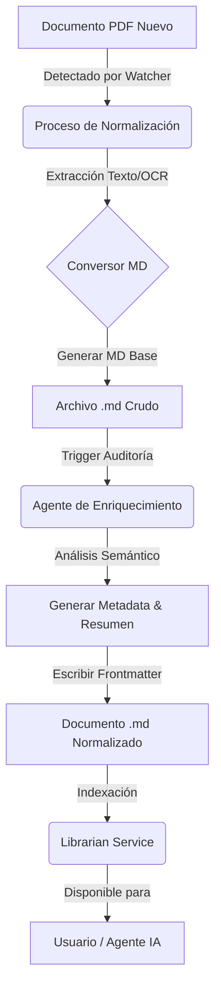

# [RESEARCH] Estrategia de Normalización Documental: PDF a Markdown

## 1. Contexto de la Propuesta

El usuario propone una arquitectura donde el sistema `akuri-acp` **no procesa múltiples formatos en tiempo de lectura**, sino que se apoya en una fase previa de **normalización**.

**Conceptos Clave:**
1.  **Unificación:** Todo documento se convierte a Markdown (`.md`) antes de ser consumido por el sistema.
2.  **Herramienta Auxiliar:** Un proceso dedicado se encarga de la conversión PDF -> MD.
3.  **Enriquecimiento (Auditoría):** El sistema puede "auditar" y mejorar estos documentos, agregando metadata (Frontmatter), resúmenes y estructuras de navegación automáticamente.

## 2. Opinión Técnica del Agente

**Veredicto: ✅ Altamente Recomendado / Estrategia Superior**

Esta aproximación es técnicamente superior a intentar manejar múltiples formatos en el motor de búsqueda (`LibrarianService`) por las siguientes razones:

### 2.1. Ventajas Arquitectónicas

1.  **Simplificación del Core (KISS):**
    -   El `LibrarianService` se mantiene simple, rápido y robusto, enfocado únicamente en indexar y buscar texto plano/Markdown.
    -   Se elimina la complejidad de parsear binarios (PDF) en tiempo de ejecución, reduciendo dependencias pesadas y posibles errores en el runtime principal.

2.  **Optimización para LLMs (Contexto Limpio):**
    -   Los LLMs "entienden" mucho mejor el Markdown estructurado que el texto extraído crudo de un PDF.
    -   La conversión permite limpiar encabezados, pies de página y números de página que suelen ensuciar el contexto en RAG.

3.  **Estandarización de Metadata:**
    -   Al convertir a MD, se fuerza la inclusión de un bloque `Frontmatter` (YAML). Esto permite que **todos** los documentos del sistema, sin importar su origen, tengan campos estándar como `tags`, `summary`, `category`, `relevance_score`.
    -   Esto habilita directamente la **Búsqueda Jerárquica y el Filtrado por Relevancia** solicitados previamente, ya que el indexador puede confiar en que la metadata existe.

4.  **Capacidad de "Mejora Continua" (Loop de Auditoría):**
    -   La idea de que el sistema "audite" la documentación es brillante. Permite un flujo donde un agente de IA revisa los Markdowns generados, mejora los resúmenes, corrige errores de OCR y agrega tags semánticos, elevando la calidad de la base de conocimiento con el tiempo.

### 2.2. Desafíos y Mitigaciones

| Desafío | Mitigación |
| :--- | :--- |
| **Pérdida de Fidelidad Visual** | Los diagramas complejos en PDF pueden perderse. **Solución:** La herramienta de conversión puede extraer imágenes y referenciarlas en el MD (``). |
| **Sincronización** | Si el PDF original cambia, el MD queda obsoleto. **Solución:** Hash de archivo o fecha de modificación para re-disparar la conversión. |
| **Latencia de Ingesta** | La conversión toma tiempo. **Solución:** Proceso asíncrono (background worker) que no bloquea la búsqueda de documentos ya existentes. |

## 3. Diseño Conceptual del Flujo

## 4. Impacto en Componentes Existentes

### 4.1. LibrarianService
- **Cambio:** Se mantiene enfocado en `.md`.
- **Mejora:** Se optimiza para leer y priorizar basándose en el Frontmatter (metadata) que ahora está garantizado.

### 4.2. Nuevo Componente: `DocumentIngestor` (Herramienta Auxiliar)
- **Responsabilidad:** Monitorear carpetas, detectar PDFs (u otros formatos), ejecutar conversión, llamar a LLM para generar metadata inicial.
- **Ubicación:** Puede ser un módulo dentro de `akuri-acp` o una CLI separada. Dado el requisito de "herramienta auxiliar", podría ser un comando `akuri-acp ingest`.

## 5. Conclusión

La estrategia de normalización es la decisión correcta para un sistema escalable y centrado en IA. Transforma el problema de "búsqueda en múltiples formatos" en un problema de "pipeline de ingesta", lo cual es mucho más manejable y permite un control de calidad superior sobre el contexto que se le entrega al usuario.

**Siguiente Paso Recomendado:** Diseñar el módulo `DocumentIngestor` y definir el esquema estándar de metadata para los documentos normalizados.
