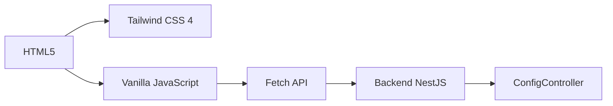

# [DESIGN] Interfaz Visual de Configuración - v0.0.3

## Resumen Ejecutivo

Este diseño define una interfaz web moderna para la administración de `akuri-acp`, reemplazando el HTML básico actual con una aplicación SPA (Single Page Application) usando **Tailwind CSS 4** y vanilla JavaScript. La interfaz permitirá configurar rutas, extensiones, visualizar métricas y gestionar el sistema de ingesta.

## Requisitos

### Funcionales
- **RF1: Gestión de Rutas**: Agregar, editar, eliminar y validar rutas de documentación.
- **RF2: Configuración de Extensiones**: Definir extensiones permitidas para ingesta (`.pdf`, `.md`, etc.).
- **RF3: Visualización de Estado**: Mostrar estado de indexación, documentos procesados y métricas de búsqueda.
- **RF4: Control de Ingesta**: Visualizar archivos PDF detectados y su estado de conversión.
- **RF5: Reindexación Manual**: Disparar reindexación con feedback visual.

### No Funcionales
- **RNF1: Diseño Moderno**: Interfaz atractiva usando Tailwind CSS 4 con modo oscuro.
- **RNF2: Responsiva**: Adaptable a diferentes tamaños de pantalla.
- **RNF3: Sin Framework JS**: Usar vanilla JavaScript para mantener simplicidad.
- **RNF4: Validación en Tiempo Real**: Feedback inmediato al usuario.

## Arquitectura General

### Stack Tecnológico



**Componentes**:
- **Frontend**: HTML + Tailwind CSS 4 (vía CDN) + Vanilla JS
- **Backend**: Endpoints consolidados en `ConfigController`
- **Comunicación**: REST API (JSON)

## Diseño de Interfaz

### Layout Principal

```
┌─────────────────────────────────────────────────┐
│  Header: Akuri ACP - Configuration Dashboard   │
├─────────────────────────────────────────────────┤
│  Tabs: [Rutas] [Extensiones] [Métricas] [Logs] │
├─────────────────────────────────────────────────┤
│                                                 │
│              Content Area                       │
│         (Tab-specific content)                  │
│                                                 │
└─────────────────────────────────────────────────┘
```

### Tab 1: Gestión de Rutas

**Componentes**:
1. **Tabla de Rutas**:
   - Columnas: Ruta | Estado | Documentos | Acciones
   - Estados: ✅ Válida | ⚠️ Advertencia | ❌ Inválida
   - Acciones: Editar | Eliminar | Reindexar

2. **Formulario de Agregar Ruta**:
   - Input de texto con validación en tiempo real
   - Botón "Validar Ruta" (llama a `/config/test-path`)
   - Botón "Agregar" (habilitado solo si válida)

3. **Acciones Globales**:
   - Botón "Guardar Configuración"
   - Botón "Reindexar Todo"

### Tab 2: Configuración de Extensiones

**Componentes**:
1. **Lista de Extensiones Permitidas**:
   - Chips editables (`.md`, `.pdf`, `.txt`, etc.)
   - Botón "+" para agregar nueva extensión
   - Botón "×" en cada chip para eliminar

2. **Configuración de Pesos de Búsqueda**:
   - Sliders para ajustar boosting:
     - Proyecto: 1.0 - 3.0 (default: 2.0)
     - Workspace: 1.0 - 2.0 (default: 1.5)
     - General: 0.5 - 1.5 (default: 1.0)
     - Interno: 0.5 - 1.0 (default: 0.8)

### Tab 3: Métricas y Estado

**Componentes**:
1. **Cards de Resumen**:
   - Total de Documentos Indexados
   - Búsquedas Realizadas
   - Tiempo Promedio de Búsqueda
   - Última Indexación

2. **Gráfico de Actividad** (opcional, usando Chart.js vía CDN):
   - Búsquedas por día (últimos 7 días)

3. **Estado de Ingesta**:
   - Tabla de archivos PDF detectados
   - Columnas: Archivo | Estado | Fecha Conversión

### Tab 4: Logs (Opcional)

**Componentes**:
- Consola de logs en tiempo real (WebSocket o polling)
- Filtros por nivel (Info, Warn, Error)

## Modelos de Datos (Frontend)

### DocumentPath
```typescript
interface DocumentPath {
  path: string;
  exists: boolean;
  isDirectory: boolean;
  documentCount: number;
  status: 'valid' | 'warning' | 'invalid';
}
```

### ConfigState
```typescript
interface ConfigState {
  paths: DocumentPath[];
  allowedExtensions: string[];
  boostWeights: {
    project: number;
    workspace: number;
    general: number;
    internal: number;
  };
}
```

## Interfaces y Contratos (API)

### Endpoints Requeridos

#### GET `/config/status`
**Response**:
```json
{
  "isInitialized": true,
  "documentCount": 150,
  "paths": ["/path/to/docs"],
  "lastIndexed": "2025-11-26T10:00:00Z"
}
```

#### GET `/config/paths`
**Response**:
```json
{
  "paths": [
    {
      "path": "/path/to/docs",
      "exists": true,
      "isDirectory": true,
      "documentCount": 50
    }
  ]
}
```

#### POST `/config/test-path`
**Request**:
```json
{ "path": "/new/path" }
```
**Response**:
```json
{
  "valid": true,
  "message": "Valid directory with 25 documents",
  "documentCount": 25
}
```

#### POST `/config/extensions` (Nuevo)
**Request**:
```json
{ "extensions": [".md", ".pdf", ".txt"] }
```

#### GET `/config/metrics` (Nuevo)
**Response**:
```json
{
  "searchCount": 120,
  "averageSearchTime": 45,
  "lastSearchTime": 32,
  "documentsIndexed": 150
}
```

## Flujo de Datos

### Flujo de Validación de Ruta
1. Usuario ingresa ruta en input.
2. Al perder foco (blur), se llama a `POST /config/test-path`.
3. Si válida: Mostrar ✅ + contador de documentos.
4. Si inválida: Mostrar ❌ + mensaje de error.
5. Botón "Agregar" solo se habilita si válida.

### Flujo de Guardado
1. Usuario hace cambios (rutas, extensiones, pesos).
2. Click en "Guardar Configuración".
3. Se envían requests a:
   - `POST /config/paths/bulk` (rutas)
   - `POST /config/extensions` (extensiones)
   - `POST /config/boost-weights` (pesos)
4. Mostrar notificación de éxito/error.
5. Recargar estado desde backend.

## Decisiones de Arquitectura

### Decisión 1: Tailwind CSS 4 vía CDN
**Contexto**: Necesidad de diseño moderno sin complejidad de build.
**Decisión**: Usar Tailwind CSS 4 vía CDN (Play CDN).
**Justificación**: 
- No requiere configuración de build (Webpack, Vite, etc.).
- Tailwind 4 tiene mejor rendimiento y nuevas utilidades.
- Ideal para aplicaciones simples sin SSR.

### Decisión 2: Vanilla JavaScript
**Contexto**: Complejidad vs Funcionalidad.
**Decisión**: No usar React/Vue/Angular.
**Justificación**:
- La aplicación es relativamente simple (CRUD de configuración).
- Evita dependencias pesadas y complejidad de build.
- Mantiene el proyecto ligero y fácil de mantener.

### Decisión 3: Consolidar en ConfigController
**Contexto**: Duplicación entre AdminController y ConfigController.
**Decisión**: Deprecar AdminController, usar solo ConfigController.
**Justificación**: ConfigController tiene mejor arquitectura (validación, DTOs, logging).

## Dependencias

### Frontend
- **Tailwind CSS 4**: Vía Play CDN
- **Heroicons** (opcional): Para iconos SVG

### Backend (Nuevos Endpoints)
- `POST /config/extensions`
- `GET /config/metrics`
- `POST /config/boost-weights`
- `POST /config/reindex`

## Consideraciones de Seguridad
- **Validación de Rutas**: Prevenir path traversal.
- **Sanitización de Inputs**: Escapar HTML en mensajes de error.
- **Rate Limiting**: Limitar requests de validación (ya existe ThrottlerModule).

## Consideraciones de UX
- **Feedback Inmediato**: Spinners durante requests.
- **Notificaciones Toast**: Para éxito/error (biblioteca ligera como `notyf`).
- **Modo Oscuro**: Usar `dark:` utilities de Tailwind.
- **Accesibilidad**: Etiquetas ARIA, navegación por teclado.

## Próximos Pasos
1. Crear mockup visual (wireframe).
2. Implementar estructura HTML con Tailwind.
3. Agregar endpoints faltantes en backend.
4. Conectar frontend con API.
5. Testing de flujos completos.
