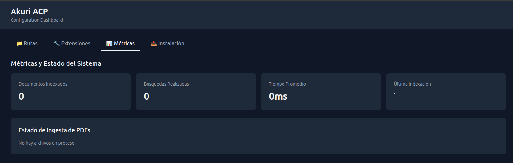

# Manual de Usuario: Gestión de Rutas de Documentación

Este manual describe cómo utilizar la pantalla de "Gestión de Rutas de Documentación" en Akuri ACP.

## 1. Descripción General

La pantalla de "Gestión de Rutas de Documentación" permite configurar y administrar las rutas donde Akuri ACP buscará y procesará sus documentos. Esto es esencial para que el sistema pueda indexar y hacer accesible su contenido.

## 2. Secciones de la Pantalla

La pantalla se divide en las siguientes secciones principales:

### 2.1. Navegación Principal

En la parte superior, encontrará las pestañas de navegación principales:
- [`Rutas`](akuri-acp/public/rutas.html): La pantalla actual para gestionar las rutas de documentación.
- [`Extensiones`](akuri-acp/public/extensiones.html): Para configurar extensiones del sistema.
- [`Métricas`](akuri-acp/public/metricas.html): Para visualizar métricas de uso y rendimiento.
- [`Instalación`](akuri-acp/public/install.html): Para acceder a la guía de instalación.

### 2.2. Rutas Configuradas

Esta sección muestra una tabla con todas las rutas de documentación que han sido configuradas en el sistema.

- **Ruta**: Muestra la dirección o el path de la carpeta donde se encuentran los documentos.
- **Estado**: Indica el estado actual de la ruta (por ejemplo, si está activa, si hay errores, etc.).
- **Documentos**: Muestra el número de documentos encontrados en esa ruta.
- **Acciones**: Permite realizar acciones sobre la ruta configurada (por ejemplo, editar, eliminar, reindexar individualmente).

Si no hay rutas configuradas, se mostrará el mensaje "No hay rutas configuradas".

### 2.3. Agregar Nueva Ruta

Esta sección permite añadir nuevas rutas de documentación al sistema.

- **Campo de entrada**: Ingrese la ruta completa de la carpeta que contiene los documentos que desea que Akuri ACP gestione. Por ejemplo: `/ruta/a/documentos`.
- **Botón [`Validar`](#)**: Haga clic en este botón para verificar si la ruta ingresada es válida y accesible por el sistema.
- **Botón [`Agregar`](#)**: Una vez validada la ruta, haga clic aquí para añadirla a la lista de "Rutas Configuradas".

### 2.4. Acciones Globales

En la parte inferior de la pantalla, encontrará botones para acciones que afectan a todas las rutas o a la configuración general:

- **Botón [`Guardar Configuración`](#)**: Guarda todos los cambios realizados en las rutas configuradas. Es crucial hacer clic en este botón después de agregar, modificar o eliminar rutas para que los cambios surtan efecto.
- **Botón [`Reindexar Todo`](#)**: Inicia un proceso de reindexación de todos los documentos en todas las rutas configuradas. Esto es útil si ha habido cambios en los documentos o en la estructura de las carpetas y desea que Akuri ACP actualice su índice.

## 3. Flujo de Uso Típico

1.  **Añadir una nueva ruta**:
    *   Ingrese la ruta de su carpeta de documentos en el campo "Agregar Nueva Ruta".
    *   Haga clic en [`Validar`](#) para asegurarse de que la ruta es correcta.
    *   Haga clic en [`Agregar`](#) para añadirla a la lista.
2.  **Guardar cambios**:
    *   Después de añadir o modificar rutas, haga clic en [`Guardar Configuración`](#).
3.  **Reindexar documentos**:
    *   Si ha añadido nuevos documentos o modificado existentes, haga clic en [`Reindexar Todo`](#) para que Akuri ACP los procese.
4.  **Gestionar rutas existentes**:
    *   Utilice las acciones en la tabla "Rutas Configuradas" para editar o eliminar rutas individuales según sea necesario.

Este manual le ayudará a gestionar eficazmente las rutas de documentación en Akuri ACP, asegurando que sus documentos estén siempre actualizados y accesibles.